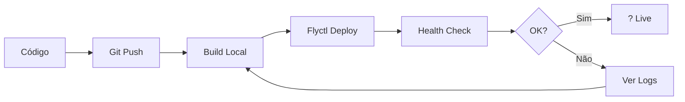

# ?? Documentação de Deploy - StockMind

## ?? Visão Geral

O StockMind está pronto para deploy no Fly.io usando Docker. Este diretório contém toda a documentação necessária.

## ?? Arquivos de Deploy

### ?? Docker
- **`Dockerfile`** (raiz) - Configuração Docker multi-stage otimizada
- **`.dockerignore`** (raiz) - Arquivos excluídos do build

### ?? Fly.io
- **`fly.toml`** (raiz) - Configuração do Fly.io
- **`DEPLOY_FLYIO.md`** - Guia completo de deploy
- **`QUICKSTART_FLYIO.md`** - Início rápido (3 minutos)
- **`DEPLOY_CHECKLIST.md`** - Checklist passo a passo
- **`COMANDOS_FLYIO.md`** - Comandos prontos para copiar
- **`TROUBLESHOOTING_DOCKER_FLYIO.md`** - Solução de problemas
- **`DEPLOY_SUMMARY.md`** - Resumo de tudo que foi criado

### ?? Scripts
- **`deploy-flyio.ps1`** (raiz) - Script PowerShell para Windows
- **`deploy-flyio.sh`** (raiz) - Script Bash para Linux/Mac

### ?? Configuração
- **`appsettings.Production.json`** - Configurações de produção

## ?? Como Começar

### Para Iniciantes (5 minutos)

1. **Leia primeiro**: [`QUICKSTART_FLYIO.md`](../QUICKSTART_FLYIO.md)
2. **Use o script**: Execute `deploy-flyio.ps1` ou `deploy-flyio.sh`
3. **Siga os prompts** e pronto!

### Para Experiência Completa (15 minutos)

1. **Leia**: [`DEPLOY_FLYIO.md`](../DEPLOY_FLYIO.md)
2. **Siga**: [`DEPLOY_CHECKLIST.md`](../DEPLOY_CHECKLIST.md)
3. **Use comandos**: [`COMANDOS_FLYIO.md`](../COMANDOS_FLYIO.md)

### Já Tem Experiência?

```bash
flyctl launch --name stockmind --region ams
```

## ?? Guias por Cenário

### ?? Primeiro Deploy

1. [`QUICKSTART_FLYIO.md`](../QUICKSTART_FLYIO.md) - Início rápido
2. [`DEPLOY_CHECKLIST.md`](../DEPLOY_CHECKLIST.md) - Não esqueça nada
3. [`COMANDOS_FLYIO.md`](../COMANDOS_FLYIO.md) - Comandos prontos

### ?? Atualizar Aplicação

```bash
# Na raiz do projeto
flyctl deploy --app stockmind
flyctl logs -f --app stockmind
```

Mais detalhes em: [`DEPLOY_FLYIO.md`](../DEPLOY_FLYIO.md#-atualizar-a-aplicação)

### ?? Problemas?

1. [`TROUBLESHOOTING_DOCKER_FLYIO.md`](../TROUBLESHOOTING_DOCKER_FLYIO.md) - Solução de problemas
2. [`COMANDOS_FLYIO.md`](../COMANDOS_FLYIO.md#-monitoramento) - Debug commands

### ?? Testar Localmente

```bash
# Build
docker build -t stockmind:local .

# Run
docker run -p 8080:8080 stockmind:local

# Test
curl http://localhost:8080/health
```

Mais em: [`DEPLOY_FLYIO.md`](../DEPLOY_FLYIO.md#-testar-localmente-com-docker)

## ?? Configurações Importantes

### Secrets Obrigatórios

```bash
flyctl secrets set JwtSettings__Secret="sua-chave-min-32-chars" --app stockmind
```

### Secrets Opcionais

```bash
# Database (se não usar Fly Postgres)
flyctl secrets set ConnectionStrings__DefaultConnection="..." --app stockmind

# Email
flyctl secrets set Email__SmtpHost="smtp.gmail.com" --app stockmind
flyctl secrets set Email__SmtpPort="587" --app stockmind
flyctl secrets set Email__FromEmail="seu@email.com" --app stockmind
flyctl secrets set Email__Password="senha" --app stockmind

# RabbitMQ
flyctl secrets set RabbitMQ__HostName="host" --app stockmind
flyctl secrets set RabbitMQ__UserName="user" --app stockmind
flyctl secrets set RabbitMQ__Password="pass" --app stockmind
```

Veja todos em: [`COMANDOS_FLYIO.md`](../COMANDOS_FLYIO.md#-configurar-secrets)

## ?? Estrutura do Deploy

```
Código Local ? Docker Build ? Fly.io Registry ? Deploy ? Running App
                     ?
              Health Check
                     ?
            ? https://stockmind.fly.dev
```

## ?? URLs Após Deploy

- **API**: `https://stockmind.fly.dev`
- **Swagger**: `https://stockmind.fly.dev/swagger`
- **Health**: `https://stockmind.fly.dev/health`
- **SignalR**: `wss://stockmind.fly.dev/hubs/stock-alerts`

## ?? Custos Estimados

### Free Tier (Teste)
- ? 3 máquinas compartilhadas (256MB)
- ? 3GB storage
- ? 160GB transfer/mês
- **Custo**: $0/mês

### Hobby Plan (Recomendado)
- 1 VM shared-cpu-1x (512MB)
- PostgreSQL incluído
- **Custo**: ~$5-10/mês

### Production
- 2+ VMs shared-cpu-2x (1GB)
- PostgreSQL dedicado
- **Custo**: ~$20-50/mês

Mais em: [`DEPLOY_FLYIO.md`](../DEPLOY_FLYIO.md#-custos)

## ?? Workflow de Deploy



## ?? Documentação Completa

### Por Ordem de Leitura

1. **[DEPLOY_SUMMARY.md](../DEPLOY_SUMMARY.md)** - ? Comece aqui! Visão geral completa
2. **[QUICKSTART_FLYIO.md](../QUICKSTART_FLYIO.md)** - Deploy em 3 minutos
3. **[DEPLOY_CHECKLIST.md](../DEPLOY_CHECKLIST.md)** - Não esqueça nada
4. **[DEPLOY_FLYIO.md](../DEPLOY_FLYIO.md)** - Guia completo e detalhado
5. **[COMANDOS_FLYIO.md](../COMANDOS_FLYIO.md)** - Comandos prontos para copiar
6. **[TROUBLESHOOTING_DOCKER_FLYIO.md](../TROUBLESHOOTING_DOCKER_FLYIO.md)** - Quando algo der errado

### Por Caso de Uso

| Cenário | Arquivo |
|---------|---------|
| Primeiro deploy | [QUICKSTART_FLYIO.md](../QUICKSTART_FLYIO.md) |
| Deploy detalhado | [DEPLOY_FLYIO.md](../DEPLOY_FLYIO.md) |
| Comandos rápidos | [COMANDOS_FLYIO.md](../COMANDOS_FLYIO.md) |
| Checklist visual | [DEPLOY_CHECKLIST.md](../DEPLOY_CHECKLIST.md) |
| Problemas | [TROUBLESHOOTING_DOCKER_FLYIO.md](../TROUBLESHOOTING_DOCKER_FLYIO.md) |
| Resumo | [DEPLOY_SUMMARY.md](../DEPLOY_SUMMARY.md) |

## ??? Ferramentas Necessárias

### Obrigatórias
- [Fly CLI](https://fly.io/docs/hands-on/install-flyctl/)
- Conta no [Fly.io](https://fly.io)

### Opcionais (mas recomendadas)
- [Docker Desktop](https://www.docker.com/products/docker-desktop) - Para testes locais
- [Git](https://git-scm.com/) - Controle de versão

## ?? Recursos de Aprendizado

### Fly.io
- [Documentação Oficial](https://fly.io/docs/)
- [.NET Guide](https://fly.io/docs/languages-and-frameworks/dotnet/)
- [Postgres Guide](https://fly.io/docs/postgres/)
- [Community Forum](https://community.fly.io/)

### Docker
- [ASP.NET Core in Docker](https://learn.microsoft.com/en-us/aspnet/core/host-and-deploy/docker/)
- [Docker Best Practices](https://docs.docker.com/develop/dev-best-practices/)

## ?? Precisa de Ajuda?

### Ordem de Troubleshooting

1. **Verifique os logs**: `flyctl logs --app stockmind`
2. **Consulte**: [TROUBLESHOOTING_DOCKER_FLYIO.md](../TROUBLESHOOTING_DOCKER_FLYIO.md)
3. **Teste localmente**: `docker build -t test .`
4. **Verifique secrets**: `flyctl secrets list --app stockmind`
5. **Acesse console**: `flyctl ssh console --app stockmind`
6. **Community**: [https://community.fly.io/](https://community.fly.io/)

### Comandos de Debug

```bash
# Ver status
flyctl status --app stockmind

# Ver logs detalhados
flyctl logs -f --app stockmind

# Acessar container
flyctl ssh console --app stockmind

# Verificar health
curl https://stockmind.fly.dev/health

# Ver configuração
flyctl config show --app stockmind
```

## ? Próximos Passos Após Deploy

1. ? Verificar se está rodando: `flyctl status`
2. ? Testar API: `curl https://stockmind.fly.dev/health`
3. ? Configurar domínio customizado (opcional)
4. ? Configurar CI/CD (opcional)
5. ? Configurar backups do banco
6. ? Monitorar logs regularmente
7. ? Documentar credenciais e URLs
8. ? Compartilhar com o time

## ?? Pronto!

Agora você tem tudo para fazer deploy do StockMind no Fly.io!

**Comando mais simples:**
```bash
flyctl launch --name stockmind --region ams
```

**Acompanhe:** [DEPLOY_CHECKLIST.md](../DEPLOY_CHECKLIST.md)

---

**?? Última atualização**: 2024  
**?? Criado por**: GitHub Copilot  
**?? Projeto**: StockMind - Sistema de Gerenciamento de Estoque
