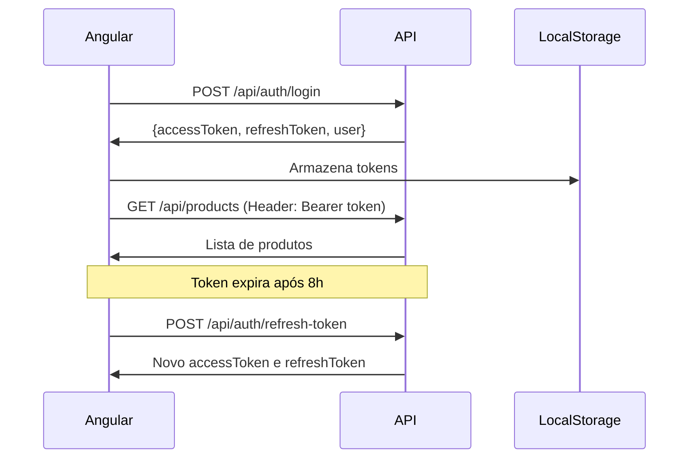

# StockMind API - Documentação para Frontend (Angular)

## ?? Índice
1. [Visão Geral](#visão-geral)
2. [Arquitetura da API](#arquitetura-da-api)
3. [Autenticação](#autenticação)
4. [Endpoints Disponíveis](#endpoints-disponíveis)
5. [Modelos de Dados (Interfaces)](#modelos-de-dados)
6. [Fluxo de Autenticação](#fluxo-de-autenticação)
7. [Sistema de Permissões](#sistema-de-permissões)
8. [Exemplos de Integração Angular](#exemplos-de-integração-angular)
9. [Tratamento de Erros](#tratamento-de-erros)
10. [Configuração do Projeto Angular](#configuração-do-projeto-angular)

---

## ?? Visão Geral

**StockMind** é uma API REST para gerenciamento de estoque construída com .NET 8, seguindo Clean Architecture e CQRS pattern.

### Informações Técnicas
- **URL Base:** `https://localhost:7xxx` (Development)
- **Autenticação:** JWT Bearer Token
- **Formato:** JSON
- **Encoding:** UTF-8
- **CORS:** Configurado (AllowAll em desenvolvimento)

### Tecnologias Utilizadas
- ? .NET 8
- ? ASP.NET Core Web API
- ? Entity Framework Core 8
- ? SQL Server
- ? JWT Authentication
- ? ASP.NET Identity
- ? Swagger/OpenAPI

---

## ??? Arquitetura da API

### Clean Architecture
```
???????????????????????????????????????
?         API Layer (Controllers)      ?
???????????????????????????????????????
?    Application Layer (Use Cases)     ?
?  • Commands (Create, Update, etc)    ?
?  • Queries (Get, List, etc)          ?
?  • Handlers (Business Logic)         ?
???????????????????????????????????????
?      Domain Layer (Entities)         ?
?  • Product, Category, Supplier       ?
?  • StockItem, StockMovement          ?
???????????????????????????????????????
?   Infrastructure (Data Access)       ?
?  • EF Core, Repositories             ?
?  • Identity, JWT                     ?
???????????????????????????????????????
```

### Padrões Implementados
- ? **CQRS** - Separação de comandos e queries
- ? **Repository Pattern** - Abstração de acesso a dados
- ? **Mediator Pattern** - MediatR para comunicação
- ? **Result Pattern** - Resposta padronizada
- ? **Domain-Driven Design** - Entidades ricas em comportamento

---

## ?? Autenticação

### JWT Bearer Token

A API usa **JWT (JSON Web Token)** para autenticação.

#### Configuração
- **Access Token:** Válido por **8 horas**
- **Refresh Token:** Válido por **7 dias**
- **Algorithm:** HMAC-SHA256
- **Header:** `Authorization: Bearer {token}`

#### Fluxo de Autenticação



---

## ?? Endpoints Disponíveis

### ?? Autenticação (Public)

#### 1. Login
```http
POST /api/auth/login
Content-Type: application/json

{
  "email": "admin@stockmind.com",
  "password": "Admin@123"
}

Response 200:
{
  "accessToken": "eyJhbGciOiJIUzI1NiIsInR5cCI6IkpXVCJ9...",
  "refreshToken": "CfDJ8N...",
  "expiresAt": "2024-01-27T03:00:00Z",
  "user": {
    "id": "guid-here",
    "email": "admin@stockmind.com",
    "fullName": "System Administrator",
    "roles": ["Admin"]
  }
}

Response 401: { "error": "Invalid email or password" }
Response 401: { "error": "Account is locked. Try again later." }
```

#### 2. Registro
```http
POST /api/auth/register
Content-Type: application/json

{
  "email": "user@example.com",
  "password": "SecurePass123",
  "fullName": "John Doe"
}

Response 200:
{
  "accessToken": "...",
  "refreshToken": "...",
  "expiresAt": "...",
  "user": {
    "id": "...",
    "email": "user@example.com",
    "fullName": "John Doe",
    "roles": ["Viewer"]  // Role padrão automática
  }
}

Response 400: { "error": "Email is already registered" }
Response 400: { "error": "Password must be at least 6 characters" }
```

#### 3. Refresh Token
```http
POST /api/auth/refresh-token
Content-Type: application/json

{
  "refreshToken": "CfDJ8N..."
}

Response 200:
{
  "accessToken": "new-token...",
  "refreshToken": "new-refresh-token...",
  "expiresAt": "...",
  "user": { ... }
}

Response 401: { "error": "Invalid or expired refresh token" }
```

#### 4. Logout (Revoke Token)
```http
POST /api/auth/revoke-token
Authorization: Bearer {token}
Content-Type: application/json

{
  "refreshToken": "CfDJ8N..."
}

Response 200: { "message": "Token revoked successfully" }
```

#### 5. Current User
```http
GET /api/auth/me
Authorization: Bearer {token}

Response 200:
{
  "userId": "guid",
  "email": "user@example.com",
  "fullName": "John Doe",
  "roles": ["Viewer"]
}
```

---

### ?? Products (Requer Autenticação)

#### 1. Listar Todos os Produtos
```http
GET /api/products
Authorization: Bearer {token}

Response 200:
[
  {
    "id": "guid",
    "name": "Notebook Dell",
    "description": "Notebook Dell Inspiron 15",
    "sku": "NB-DELL-001",
    "barcode": "7891234567890",
    "priceAmount": 3500.00,
    "priceCurrency": "BRL",
    "costPriceAmount": 2800.00,
    "costPriceCurrency": "BRL",
    "status": "Active",
    "categoryId": "guid",
    "categoryName": "Eletrônicos",
    "supplierId": "guid",
    "supplierName": "Dell Brasil",
    "minimumStock": 5,
    "imageUrl": "https://...",
    "createdAt": "2024-01-26T10:00:00Z",
    "updatedAt": null
  }
]

Permissions: Admin, Manager, Operator, Viewer
```

#### 2. Buscar Produto por ID
```http
GET /api/products/{id}
Authorization: Bearer {token}

Response 200: (mesmo formato acima)
Response 404: { "error": "Product not found" }

Permissions: Admin, Manager, Operator, Viewer
```

#### 3. Buscar Produto por SKU
```http
GET /api/products/sku/{sku}
Authorization: Bearer {token}

Response 200: (mesmo formato acima)
Response 404: { "error": "Product not found" }

Permissions: Admin, Manager, Operator, Viewer
```

#### 4. Criar Produto
```http
POST /api/products
Authorization: Bearer {token}
Content-Type: application/json

{
  "name": "Mouse Logitech",
  "description": "Mouse sem fio ergonômico",
  "sku": "MS-LOG-001",
  "priceAmount": 89.90,
  "priceCurrency": "BRL",
  "costPriceAmount": 60.00,
  "costPriceCurrency": "BRL",
  "categoryId": "guid-categoria",
  "supplierId": "guid-fornecedor",
  "minimumStock": 10,
  "barcode": "7891234567891",
  "imageUrl": "https://..."
}

Response 201: { "id": "guid-do-produto-criado" }
Response 400: { "error": "SKU already exists" }
Response 400: { "error": "Category not found" }

Permissions: Admin, Manager
```

#### 5. Atualizar Produto
```http
PUT /api/products/{id}
Authorization: Bearer {token}
Content-Type: application/json

{
  "id": "guid-do-produto",
  "name": "Mouse Logitech MX Master",
  "description": "Atualizado",
  "priceAmount": 99.90,
  "priceCurrency": "BRL",
  "costPriceAmount": 65.00,
  "costPriceCurrency": "BRL",
  "categoryId": "guid",
  "supplierId": "guid",
  "minimumStock": 15,
  "barcode": "7891234567891",
  "imageUrl": "https://..."
}

Response 204: No Content
Response 400: { "error": "ID mismatch" }
Response 404: { "error": "Product not found" }

Permissions: Admin, Manager
```

---

### ?? Stock (Requer Autenticação)

#### 1. Buscar Estoque por Produto
```http
GET /api/stock/product/{productId}
Authorization: Bearer {token}

Response 200:
{
  "id": "guid",
  "productId": "guid",
  "productName": "Notebook Dell",
  "productSku": "NB-DELL-001",
  "quantity": 25,
  "reservedQuantity": 3,
  "availableQuantity": 22,
  "minimumStock": 5,
  "location": "Prateleira A1",
  "isLowStock": false,
  "createdAt": "2024-01-26T10:00:00Z",
  "updatedAt": "2024-01-26T15:30:00Z"
}

Response 404: { "error": "Stock item not found for this product" }

Permissions: Admin, Manager, Operator, Viewer
```

#### 2. Produtos com Estoque Baixo
```http
GET /api/stock/low-stock
Authorization: Bearer {token}

Response 200:
[
  {
    "id": "guid",
    "productId": "guid",
    "productName": "Mouse Logitech",
    "productSku": "MS-LOG-001",
    "quantity": 3,
    "reservedQuantity": 0,
    "availableQuantity": 3,
    "minimumStock": 10,
    "location": "Prateleira B2",
    "isLowStock": true,
    "createdAt": "...",
    "updatedAt": "..."
  }
]

Permissions: Admin, Manager, Operator
```

#### 3. Adicionar Estoque
```http
POST /api/stock/add
Authorization: Bearer {token}
Content-Type: application/json

{
  "productId": "guid",
  "quantity": 50,
  "reference": "Nota Fiscal #12345",
  "notes": "Compra do fornecedor XYZ"
}

Response 200:
{
  "success": true,
  "message": "Stock added successfully"
}

Response 400: { "error": "Product not found" }
Response 400: { "error": "Quantity must be greater than zero" }

Permissions: Admin, Manager, Operator
```

#### 4. Remover Estoque
```http
POST /api/stock/remove
Authorization: Bearer {token}
Content-Type: application/json

{
  "productId": "guid",
  "quantity": 5,
  "reference": "Venda #98765",
  "notes": "Venda ao cliente ABC"
}

Response 200:
{
  "success": true,
  "message": "Stock removed successfully"
}

Response 400: { "error": "Insufficient stock" }
Response 400: { "error": "Product not found" }

Permissions: Admin, Manager, Operator
```

#### 5. Ajustar Estoque
```http
POST /api/stock/adjust
Authorization: Bearer {token}
Content-Type: application/json

{
  "productId": "guid",
  "newQuantity": 100,
  "reference": "Inventário 2024",
  "notes": "Ajuste de inventário mensal"
}

Response 200:
{
  "success": true,
  "message": "Stock adjusted successfully"
}

Response 400: { "error": "Product not found" }

Permissions: Admin, Manager
```

---

### ?? Categories (Requer Autenticação)

#### 1. Listar Todas as Categorias
```http
GET /api/categories
Authorization: Bearer {token}

Response 200:
[
  {
    "id": "guid",
    "name": "Eletrônicos",
    "description": "Produtos eletrônicos em geral",
    "isActive": true,
    "createdAt": "2024-01-26T10:00:00Z",
    "updatedAt": null
  }
]

Permissions: Admin, Manager, Operator, Viewer
```

#### 2. Criar Categoria
```http
POST /api/categories
Authorization: Bearer {token}
Content-Type: application/json

{
  "name": "Periféricos",
  "description": "Teclados, mouses, etc"
}

Response 201: { "id": "guid-da-categoria" }
Response 400: { "error": "Category with name 'Periféricos' already exists" }

Permissions: Admin, Manager
```

---

### ?? User Management (Admin Only)

#### Alterar Role de Usuário
```http
PUT /api/auth/users/{userId}/role
Authorization: Bearer {admin-token}
Content-Type: application/json

{
  "newRole": "Manager"
}

Response 200: { "message": "User role updated successfully" }
Response 400: { "error": "User not found" }
Response 400: { "error": "Invalid role. Must be Admin, Manager, Operator, or Viewer" }
Response 403: Forbidden (apenas Admin pode usar)

Permissions: Admin
Roles válidas: "Admin", "Manager", "Operator", "Viewer"
```

---

## ?? Modelos de Dados (Interfaces TypeScript)

### Auth Models
```typescript
// auth.models.ts

export interface LoginRequest {
  email: string;
  password: string;
}

export interface RegisterRequest {
  email: string;
  password: string;
  fullName: string;
}

export interface AuthResponse {
  accessToken: string;
  refreshToken: string;
  expiresAt: string; // ISO 8601 date
  user: User;
}

export interface User {
  id: string; // GUID
  email: string;
  fullName: string;
  roles: UserRole[];
}

export enum UserRole {
  Admin = 'Admin',
  Manager = 'Manager',
  Operator = 'Operator',
  Viewer = 'Viewer'
}

export interface RefreshTokenRequest {
  refreshToken: string;
}

export interface ChangeUserRoleRequest {
  newRole: UserRole;
}
```

### Product Models
```typescript
// product.models.ts

export interface Product {
  id: string;
  name: string;
  description: string;
  sku: string;
  barcode?: string;
  priceAmount: number;
  priceCurrency: string; // "BRL", "USD"
  costPriceAmount: number;
  costPriceCurrency: string;
  status: ProductStatus;
  categoryId: string;
  categoryName?: string;
  supplierId?: string;
  supplierName?: string;
  minimumStock: number;
  imageUrl?: string;
  createdAt: string; // ISO 8601
  updatedAt?: string;
}

export enum ProductStatus {
  Active = 'Active',
  Inactive = 'Inactive',
  Discontinued = 'Discontinued'
}

export interface CreateProductRequest {
  name: string;
  description: string;
  sku: string;
  priceAmount: number;
  priceCurrency: string;
  costPriceAmount: number;
  costPriceCurrency: string;
  categoryId: string;
  supplierId?: string;
  minimumStock: number;
  barcode?: string;
  imageUrl?: string;
}

export interface UpdateProductRequest extends CreateProductRequest {
  id: string;
}
```

### Stock Models
```typescript
// stock.models.ts

export interface StockItem {
  id: string;
  productId: string;
  productName: string;
  productSku: string;
  quantity: number;
  reservedQuantity: number;
  availableQuantity: number;
  minimumStock: number;
  location?: string;
  isLowStock: boolean;
  createdAt: string;
  updatedAt?: string;
}

export interface AddStockRequest {
  productId: string;
  quantity: number;
  reference?: string;
  notes?: string;
}

export interface RemoveStockRequest {
  productId: string;
  quantity: number;
  reference?: string;
  notes?: string;
}

export interface AdjustStockRequest {
  productId: string;
  newQuantity: number;
  reference?: string;
  notes?: string;
}
```

### Category Models
```typescript
// category.models.ts

export interface Category {
  id: string;
  name: string;
  description: string;
  isActive: boolean;
  createdAt: string;
  updatedAt?: string;
}

export interface CreateCategoryRequest {
  name: string;
  description: string;
}
```

### API Response Models
```typescript
// api.models.ts

export interface ApiError {
  error: string;
}

export interface ApiSuccess {
  success: boolean;
  message: string;
}
```

---

## ?? Fluxo de Autenticação

### 1. Login Flow
```typescript
// auth.service.ts
import { Injectable } from '@angular/core';
import { HttpClient } from '@angular/common/http';
import { Observable, tap } from 'rxjs';

@Injectable({ providedIn: 'root' })
export class AuthService {
  private apiUrl = 'https://localhost:7xxx/api/auth';
  
  constructor(private http: HttpClient) {}

  login(email: string, password: string): Observable<AuthResponse> {
    return this.http.post<AuthResponse>(`${this.apiUrl}/login`, { email, password })
      .pipe(
        tap(response => {
          // Armazena tokens
          localStorage.setItem('accessToken', response.accessToken);
          localStorage.setItem('refreshToken', response.refreshToken);
          localStorage.setItem('user', JSON.stringify(response.user));
        })
      );
  }

  register(request: RegisterRequest): Observable<AuthResponse> {
    return this.http.post<AuthResponse>(`${this.apiUrl}/register`, request)
      .pipe(
        tap(response => {
          localStorage.setItem('accessToken', response.accessToken);
          localStorage.setItem('refreshToken', response.refreshToken);
          localStorage.setItem('user', JSON.stringify(response.user));
        })
      );
  }

  logout(): Observable<ApiSuccess> {
    const refreshToken = localStorage.getItem('refreshToken');
    return this.http.post<ApiSuccess>(`${this.apiUrl}/revoke-token`, { refreshToken })
      .pipe(
        tap(() => {
          localStorage.removeItem('accessToken');
          localStorage.removeItem('refreshToken');
          localStorage.removeItem('user');
        })
      );
  }

  refreshToken(): Observable<AuthResponse> {
    const refreshToken = localStorage.getItem('refreshToken');
    return this.http.post<AuthResponse>(`${this.apiUrl}/refresh-token`, { refreshToken })
      .pipe(
        tap(response => {
          localStorage.setItem('accessToken', response.accessToken);
          localStorage.setItem('refreshToken', response.refreshToken);
        })
      );
  }

  getCurrentUser(): Observable<User> {
    return this.http.get<User>(`${this.apiUrl}/me`);
  }

  getToken(): string | null {
    return localStorage.getItem('accessToken');
  }

  isAuthenticated(): boolean {
    return !!this.getToken();
  }

  getUserRoles(): UserRole[] {
    const userStr = localStorage.getItem('user');
    if (!userStr) return [];
    const user: User = JSON.parse(userStr);
    return user.roles;
  }

  hasRole(role: UserRole): boolean {
    return this.getUserRoles().includes(role);
  }
}
```

### 2. HTTP Interceptor (Auto-attach Token)
```typescript
// auth.interceptor.ts
import { Injectable } from '@angular/core';
import { HttpInterceptor, HttpRequest, HttpHandler, HttpEvent, HttpErrorResponse } from '@angular/common/http';
import { Observable, throwError, BehaviorSubject } from 'rxjs';
import { catchError, filter, take, switchMap } from 'rxjs/operators';
import { AuthService } from './auth.service';
import { Router } from '@angular/router';

@Injectable()
export class AuthInterceptor implements HttpInterceptor {
  private isRefreshing = false;
  private refreshTokenSubject: BehaviorSubject<any> = new BehaviorSubject<any>(null);

  constructor(
    private authService: AuthService,
    private router: Router
  ) {}

  intercept(req: HttpRequest<any>, next: HttpHandler): Observable<HttpEvent<any>> {
    const token = this.authService.getToken();

    if (token) {
      req = this.addToken(req, token);
    }

    return next.handle(req).pipe(
      catchError(error => {
        if (error instanceof HttpErrorResponse && error.status === 401) {
          return this.handle401Error(req, next);
        }
        return throwError(() => error);
      })
    );
  }

  private addToken(request: HttpRequest<any>, token: string): HttpRequest<any> {
    return request.clone({
      setHeaders: {
        Authorization: `Bearer ${token}`
      }
    });
  }

  private handle401Error(request: HttpRequest<any>, next: HttpHandler): Observable<HttpEvent<any>> {
    if (!this.isRefreshing) {
      this.isRefreshing = true;
      this.refreshTokenSubject.next(null);

      return this.authService.refreshToken().pipe(
        switchMap((response: AuthResponse) => {
          this.isRefreshing = false;
          this.refreshTokenSubject.next(response.accessToken);
          return next.handle(this.addToken(request, response.accessToken));
        }),
        catchError((err) => {
          this.isRefreshing = false;
          this.authService.logout();
          this.router.navigate(['/login']);
          return throwError(() => err);
        })
      );
    } else {
      return this.refreshTokenSubject.pipe(
        filter(token => token != null),
        take(1),
        switchMap(token => next.handle(this.addToken(request, token)))
      );
    }
  }
}
```

### 3. Route Guard (Proteger Rotas)
```typescript
// auth.guard.ts
import { Injectable } from '@angular/core';
import { CanActivate, ActivatedRouteSnapshot, RouterStateSnapshot, Router } from '@angular/router';
import { AuthService } from './auth.service';
import { UserRole } from './models/auth.models';

@Injectable({ providedIn: 'root' })
export class AuthGuard implements CanActivate {
  constructor(
    private authService: AuthService,
    private router: Router
  ) {}

  canActivate(route: ActivatedRouteSnapshot, state: RouterStateSnapshot): boolean {
    if (!this.authService.isAuthenticated()) {
      this.router.navigate(['/login'], { queryParams: { returnUrl: state.url } });
      return false;
    }

    // Verificar roles se especificado
    const requiredRoles = route.data['roles'] as UserRole[];
    if (requiredRoles && requiredRoles.length > 0) {
      const hasRole = requiredRoles.some(role => this.authService.hasRole(role));
      if (!hasRole) {
        this.router.navigate(['/forbidden']);
        return false;
      }
    }

    return true;
  }
}

// Uso nas rotas:
// { path: 'products', component: ProductsComponent, canActivate: [AuthGuard] }
// { path: 'admin', component: AdminComponent, canActivate: [AuthGuard], data: { roles: [UserRole.Admin] } }
```

---

## ??? Sistema de Permissões

### Hierarquia de Roles

| Role | Nível | Products | Stock | Categories | Users |
|------|-------|----------|-------|------------|-------|
| **Admin** | 1 | ? CRUD | ? CRUD + Adjust | ? CRUD | ? Manage Roles |
| **Manager** | 2 | ? CRUD | ? CRUD + Adjust | ? CRUD | ? |
| **Operator** | 3 | ? View | ? Add/Remove | ? View | ? |
| **Viewer** | 4 | ? View | ? View | ? View | ? |

### Directive para Roles (Angular)
```typescript
// has-role.directive.ts
import { Directive, Input, TemplateRef, ViewContainerRef } from '@angular/core';
import { AuthService } from './auth.service';
import { UserRole } from './models/auth.models';

@Directive({
  selector: '[appHasRole]'
})
export class HasRoleDirective {
  constructor(
    private templateRef: TemplateRef<any>,
    private viewContainer: ViewContainerRef,
    private authService: AuthService
  ) {}

  @Input() set appHasRole(roles: UserRole | UserRole[]) {
    const rolesArray = Array.isArray(roles) ? roles : [roles];
    const hasRole = rolesArray.some(role => this.authService.hasRole(role));

    if (hasRole) {
      this.viewContainer.createEmbeddedView(this.templateRef);
    } else {
      this.viewContainer.clear();
    }
  }
}

// Uso no HTML:
// <button *appHasRole="UserRole.Admin">Delete</button>
// <div *appHasRole="[UserRole.Admin, UserRole.Manager]">Admin/Manager Content</div>
```

---

## ?? Tratamento de Erros

### Estrutura de Erro Padrão
```typescript
interface ApiError {
  error: string;
}

// Exemplo de resposta de erro:
// Status 400: { "error": "Product not found" }
// Status 401: { "error": "Invalid email or password" }
// Status 403: { "error": "Forbidden" }
// Status 404: { "error": "Resource not found" }
```

### Error Interceptor
```typescript
// error.interceptor.ts
import { Injectable } from '@angular/core';
import { HttpInterceptor, HttpRequest, HttpHandler, HttpEvent, HttpErrorResponse } from '@angular/common/http';
import { Observable, throwError } from 'rxjs';
import { catchError } from 'rxjs/operators';
import { MatSnackBar } from '@angular/material/snack-bar';

@Injectable()
export class ErrorInterceptor implements HttpInterceptor {
  constructor(private snackBar: MatSnackBar) {}

  intercept(req: HttpRequest<any>, next: HttpHandler): Observable<HttpEvent<any>> {
    return next.handle(req).pipe(
      catchError((error: HttpErrorResponse) => {
        let errorMessage = 'An error occurred';

        if (error.error?.error) {
          errorMessage = error.error.error;
        } else if (error.message) {
          errorMessage = error.message;
        }

        this.snackBar.open(errorMessage, 'Close', {
          duration: 5000,
          horizontalPosition: 'end',
          verticalPosition: 'top',
          panelClass: ['error-snackbar']
        });

        return throwError(() => error);
      })
    );
  }
}
```

---

## ?? Configuração do Projeto Angular

### 1. Instalação
```bash
ng new stockmind-frontend
cd stockmind-frontend
npm install
```

### 2. Instalar Dependências
```bash
# Angular Material (UI Components)
ng add @angular/material

# HTTP Client já vem com Angular
```

### 3. Configurar Environment
```typescript
// src/environments/environment.ts
export const environment = {
  production: false,
  apiUrl: 'https://localhost:7xxx/api'
};

// src/environments/environment.prod.ts
export const environment = {
  production: true,
  apiUrl: 'https://api.stockmind.com/api'
};
```

### 4. Configurar HttpClient
```typescript
// app.config.ts (Angular 17+)
import { ApplicationConfig, provideZoneChangeDetection } from '@angular/core';
import { provideRouter } from '@angular/router';
import { provideHttpClient, withInterceptors } from '@angular/common/http';
import { authInterceptor } from './core/interceptors/auth.interceptor';
import { errorInterceptor } from './core/interceptors/error.interceptor';

export const appConfig: ApplicationConfig = {
  providers: [
    provideZoneChangeDetection({ eventCoalescing: true }),
    provideRouter(routes),
    provideHttpClient(
      withInterceptors([authInterceptor, errorInterceptor])
    )
  ]
};
```

### 5. Estrutura de Pastas Sugerida
```
src/
??? app/
?   ??? core/
?   ?   ??? services/
?   ?   ?   ??? auth.service.ts
?   ?   ?   ??? product.service.ts
?   ?   ?   ??? stock.service.ts
?   ?   ?   ??? category.service.ts
?   ?   ??? guards/
?   ?   ?   ??? auth.guard.ts
?   ?   ??? interceptors/
?   ?   ?   ??? auth.interceptor.ts
?   ?   ?   ??? error.interceptor.ts
?   ?   ??? models/
?   ?       ??? auth.models.ts
?   ?       ??? product.models.ts
?   ?       ??? stock.models.ts
?   ?       ??? category.models.ts
?   ??? features/
?   ?   ??? auth/
?   ?   ?   ??? login/
?   ?   ?   ??? register/
?   ?   ??? products/
?   ?   ?   ??? product-list/
?   ?   ?   ??? product-detail/
?   ?   ?   ??? product-form/
?   ?   ??? stock/
?   ?   ?   ??? stock-list/
?   ?   ?   ??? stock-management/
?   ?   ??? admin/
?   ?       ??? user-management/
?   ??? shared/
?       ??? components/
?       ??? directives/
?       ?   ??? has-role.directive.ts
?       ??? pipes/
??? environments/
```

---

## ?? Exemplos de Serviços Angular

### Product Service
```typescript
// product.service.ts
import { Injectable } from '@angular/core';
import { HttpClient } from '@angular/common/http';
import { Observable } from 'rxjs';
import { environment } from '@environments/environment';
import { Product, CreateProductRequest, UpdateProductRequest } from '@core/models/product.models';

@Injectable({ providedIn: 'root' })
export class ProductService {
  private apiUrl = `${environment.apiUrl}/products`;

  constructor(private http: HttpClient) {}

  getAll(): Observable<Product[]> {
    return this.http.get<Product[]>(this.apiUrl);
  }

  getById(id: string): Observable<Product> {
    return this.http.get<Product>(`${this.apiUrl}/${id}`);
  }

  getBySku(sku: string): Observable<Product> {
    return this.http.get<Product>(`${this.apiUrl}/sku/${sku}`);
  }

  create(request: CreateProductRequest): Observable<{ id: string }> {
    return this.http.post<{ id: string }>(this.apiUrl, request);
  }

  update(id: string, request: UpdateProductRequest): Observable<void> {
    return this.http.put<void>(`${this.apiUrl}/${id}`, request);
  }
}
```

### Stock Service
```typescript
// stock.service.ts
import { Injectable } from '@angular/core';
import { HttpClient } from '@angular/common/http';
import { Observable } from 'rxjs';
import { environment } from '@environments/environment';
import { StockItem, AddStockRequest, RemoveStockRequest, AdjustStockRequest } from '@core/models/stock.models';
import { ApiSuccess } from '@core/models/api.models';

@Injectable({ providedIn: 'root' })
export class StockService {
  private apiUrl = `${environment.apiUrl}/stock`;

  constructor(private http: HttpClient) {}

  getByProductId(productId: string): Observable<StockItem> {
    return this.http.get<StockItem>(`${this.apiUrl}/product/${productId}`);
  }

  getLowStock(): Observable<StockItem[]> {
    return this.http.get<StockItem[]>(`${this.apiUrl}/low-stock`);
  }

  addStock(request: AddStockRequest): Observable<ApiSuccess> {
    return this.http.post<ApiSuccess>(`${this.apiUrl}/add`, request);
  }

  removeStock(request: RemoveStockRequest): Observable<ApiSuccess> {
    return this.http.post<ApiSuccess>(`${this.apiUrl}/remove`, request);
  }

  adjustStock(request: AdjustStockRequest): Observable<ApiSuccess> {
    return this.http.post<ApiSuccess>(`${this.apiUrl}/adjust`, request);
  }
}
```

### Category Service
```typescript
// category.service.ts
import { Injectable } from '@angular/core';
import { HttpClient } from '@angular/common/http';
import { Observable } from 'rxjs';
import { environment } from '@environments/environment';
import { Category, CreateCategoryRequest } from '@core/models/category.models';

@Injectable({ providedIn: 'root' })
export class CategoryService {
  private apiUrl = `${environment.apiUrl}/categories`;

  constructor(private http: HttpClient) {}

  getAll(): Observable<Category[]> {
    return this.http.get<Category[]>(this.apiUrl);
  }

  create(request: CreateCategoryRequest): Observable<{ id: string }> {
    return this.http.post<{ id: string }>(this.apiUrl, request);
  }
}
```

---

## ?? Links Úteis

### Swagger/OpenAPI
- **URL:** `https://localhost:7xxx/swagger`
- Acesse para testar endpoints interativamente
- Documentação automática de todos os endpoints

### Postman Collection
Importe a collection do Swagger para Postman:
```
https://localhost:7xxx/swagger/v1/swagger.json
```

---

## ?? Notas Importantes

### 1. CORS
- API configurada para aceitar requisições de qualquer origem em desenvolvimento
- Em produção, configure origens específicas

### 2. HTTPS
- API usa HTTPS em desenvolvimento (certificado auto-assinado)
- Pode precisar aceitar certificado no navegador

### 3. Refresh Token
- Implementar refresh automático no interceptor
- Armazenar tokens de forma segura (considere usar httpOnly cookies em produção)

### 4. Validações
- Backend já valida todos os campos
- Frontend deve validar antes de enviar para melhor UX

### 5. Paginação
- Endpoints retornam todas as entidades (sem paginação)
- Implemente paginação no frontend se necessário

---

## ?? Próximos Passos

1. **Setup do Projeto Angular**
   ```bash
   ng new stockmind-frontend
   ng add @angular/material
   ```

2. **Criar Serviços Base**
   - AuthService
   - ProductService
   - StockService
   - CategoryService

3. **Implementar Autenticação**
   - Login/Register pages
   - Auth guard
   - Token interceptor

4. **Criar Componentes**
   - Product list/detail/form
   - Stock management
   - Dashboard com low-stock alerts

5. **Adicionar Features**
   - Real-time notifications
   - Export to Excel
   - Gráficos e relatórios

---

## ?? Suporte

Para dúvidas sobre a API:
- **Swagger UI:** `https://localhost:7xxx/swagger`
- **Documentação:** Este arquivo
- **Repositório:** https://github.com/gustavorr21/StockMind

---

## ? Checklist de Integração

- [ ] Configurar environment com URL da API
- [ ] Criar modelos TypeScript (interfaces)
- [ ] Implementar AuthService
- [ ] Criar interceptores (Auth + Error)
- [ ] Implementar guards de rota
- [ ] Criar serviços para cada módulo
- [ ] Implementar login/register
- [ ] Testar fluxo de autenticação
- [ ] Criar CRUD de produtos
- [ ] Implementar gerenciamento de estoque
- [ ] Adicionar sistema de permissões por role
- [ ] Implementar tratamento de erros
- [ ] Testar refresh token automático

---

**Boa sorte com o desenvolvimento! ??**
